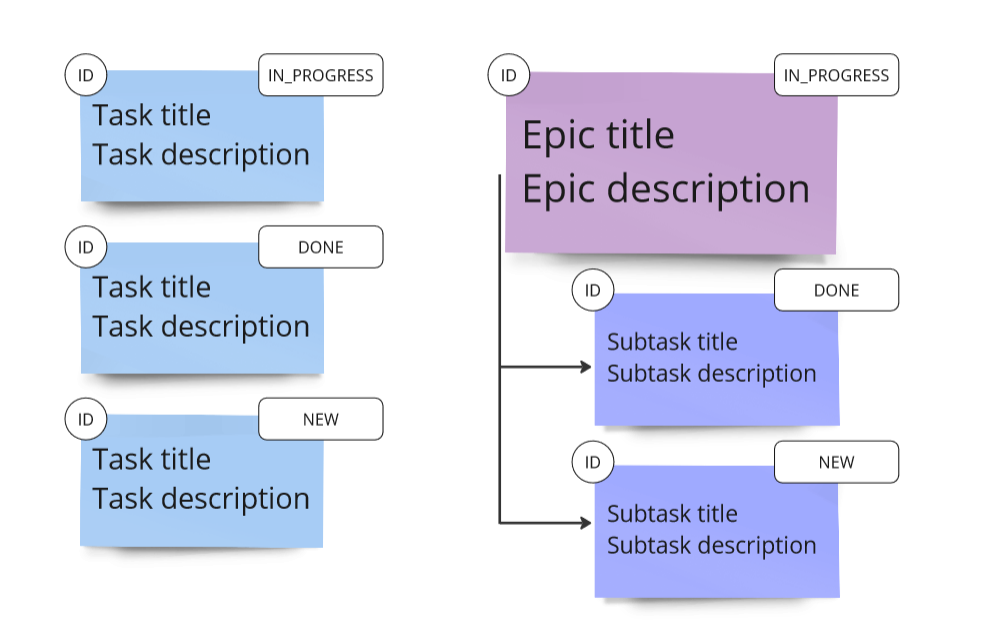

# java-kanban

Repository for homework project.

## Таск менеджер

Спринт 4 -- Версия 2.2

## Доступный функционал

1. Создание тасок, эпиков и сабтасок, привязанных к эпику
2. Обновление заголовка и описания для таски, эпика и сабтаски
3. Обновление статуса для таски и сабтаски (NEW, IN_PROGRESS или DONE)
4. Статус эпика рассчитывается автоматически на базе статусов его сабтасок
5. Перемещение сабтаски между эпиками
6. Удаление таски, сабтаски и эпика (с сабтасками) по ID
7. Удаление всех сабтасок эпика по его ID
8. Удаление всех тасок и всех эпиков
9. Вывод информации по сущностям в строку
10. Сохранение истории просмотров задач - 10 последних 
11. Управление приложением через методы объектов TaskManager и HistoryManager в файле Main.java

## Лог версий

### Версия 2.2

Обновлён метод getHistory() - теперь он возвращает список просмотренных задач вместо вывода информации.

Обновлены тесты для демонстрации функционала.

### Версия 2.1

Спринт 4

InMemoryHistoryManager интегрирован внутрь InMemoryTaskManager. 

Обновлена структура хранения истории - используется LinkedList<>. Свежие просмотры добавляются наверх списка.

Удалены методы вывода информации о задачах в консоль. 

Файлы классов разложены по пакетам model и manager. 

Обновлены тесты для демонстрации функционала.

### Версия 2.0

Спринт 4

Добавлен функционал сохранения истории просмотра задач, эпиков и сабтасок. Сохраняется 10 последних сущностей. При достижении порога в 10 штук - старые записи удаляются.

TaskManager и HistoryManager вынесены в интерфейсы для дальнейшего расширения проекта. 

Добавлен класс Managers для автоматического подбора актуальных объектов, наследующих интерфейсы TaskManager и HistoryManager.

На данный момент реализован только один вариант этих менеджеров - InMemory. 

Обновлены тесты для демонстрации функционала.

### Версия 1.2

Спринт 3

Для всех трёх типов сущностей: 
- переопределён метод toString();
- метод создания сущности возвращает созданный объект;
- добавлены методы получения объектов по ID.

### Версия 1.1

Спринт 3

Обновлён дизайн программы: структура хранения объектов представляет из себя три HashMap'ы, по одной для каждого типа сущностей. Эпик хранит в себе ArrayList с идентификаторами сабтасок.

Обновление объектов теперь выполняется через set-методы вместо создания новых объектов. 

Внесены сопутствующие изменения кода для работы с новой структурой и методами.

Отступления от ТЗ согласованы с ревьювером.

### Версия 1.0

Спринт 3

Реализована версия с одной HashMap для хранения тасок и эпиков вместе, сабтаски хранятся в HashMap внутри эпика.
