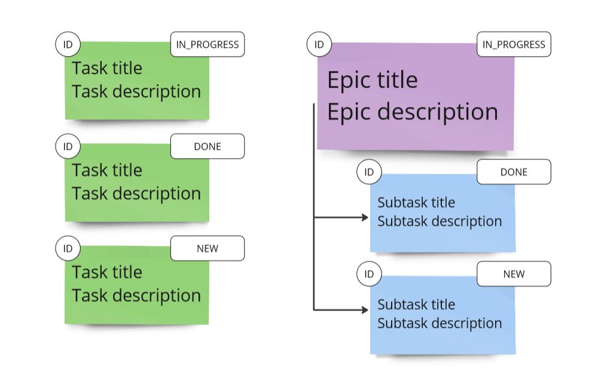

# java-kanban

Repository for homework project.

## Таск менеджер

Спринт 3 -- Версия 1.1

## Доступный функционал

1. Создание тасок, эпиков и сабтасок, привязанных к эпику
2. Обновление заголовка и описания для таски, эпика и сабтаски
3. Обновление статуса для таски и сабтаски (NEW, IN_PROGRESS или DONE)
4. Статус эпика рассчитывается автоматически на базе статусов его сабтасок
5. Перемещение сабтаски между эпиками
6. Удаление таски, сабтаски и эпика (с сабтасками) по ID
7. Удаление всех сабтасок эпика по его ID
8. Удаление всех тасок и всех эпиков
9. Вывод информации по сущностям по ID или всех подряд (сжатый или полный вид для эпиков)
10. Управление приложением через методы объекта TaskManager в файле Main.java

## Лог версий

### Версия 1.1

Спринт 3

Обновлён дизайн программы: структура хранения объектов представляет из себя три HashMap'ы, по одной для каждого типа сущностей. Эпик хранит в себе ArrayList с идентификаторами сабтасок.

Обновление объектов теперь выполняется через set-методы вместо создания новых объектов. 

Внесены сопутствующие изменения кода для работы с новой структурой и методами.

Отступления от ТЗ согласованы с ревьювером.

### Версия 1.0

Спринт 3

Реализована версия с одной HashMap для хранения тасок и эпиков вместе, сабтаски хранятся в HashMap внутри эпика.
